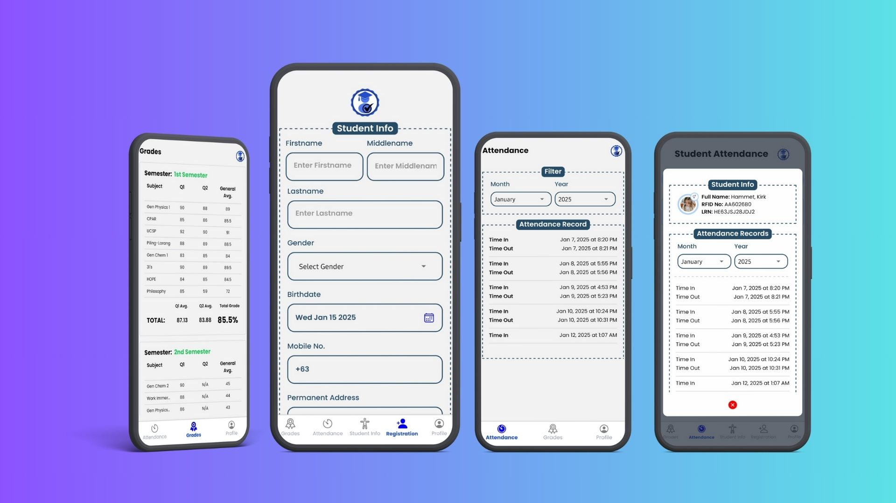
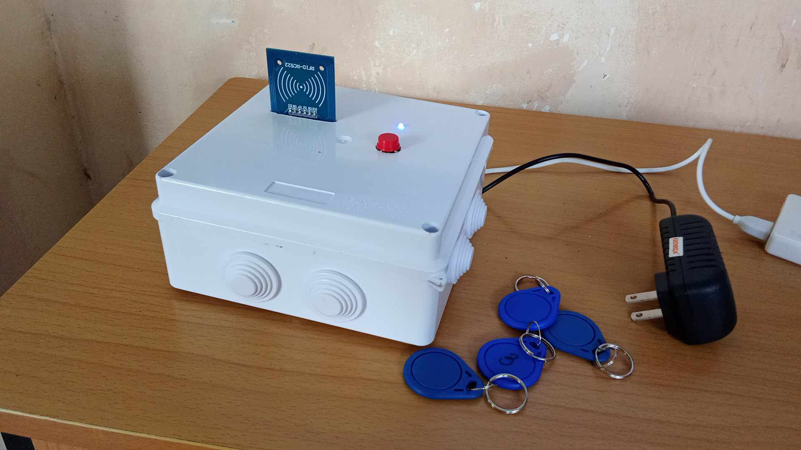
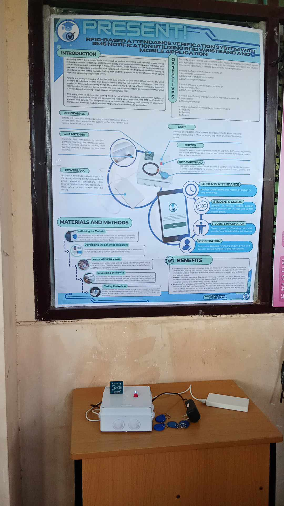

# Present! - IoT Mobile App for Student Attendance and Grades

**Present!** is an IoT-based **student attendance and grade tracking app** designed for teachers and students. The app uses **React Native Expo** for the mobile interface and **Firebase** for real-time data storage. The app allows students to log their attendance using **RFID cards** and notifies guardians via **SMS** when their child checks in or out. The app also supports temporary password changes for students.

## Features

- **Two User Roles**: 
  - **Students**: Can log attendance using their **RFID card** and change their temporary password set by the teacher.
  - **Teachers**: Register students by assigning an **RFID number** and **guardian mobile number** for SMS notifications.

- **RFID Card Scanning**: 
  - **Students** use their **RFID card** to scan their attendance.
  - The device will check the card and the student can toggle to either **TIME IN** or **TIME OUT**.
  
- **SMS Notifications**: 
  - Once attendance is marked, the app sends an **SMS** to the **guardian's mobile number** with the student’s name and the time of their check-in or check-out. This ensures parents/guardians are notified in real-time.
  - **SIM800L** module integrated for SMS functionality.

- **Temporary Password Change**: 
  - Students can change the temporary password provided by the teacher through the app.
  
- **Teacher Registration**: 
  - Teachers register student details along with the **RFID number** and **guardian mobile number** to allow SMS notifications.

## Installation

### Prerequisites

Make sure the following tools are installed:

- **Node.js** (for managing JavaScript dependencies)
- **React Native CLI** (to run and build the mobile app)
- **Expo CLI** (for building and running the app with Expo)
- **Firebase** (for real-time data storage)
- **ESP8266** (for the hardware side communication)
- **SIM800L** (for SMS functionality)
- **MFRC-522 RC522 RFID Card Reader** (for RFID scanning)

### Steps

1. **Clone the repository**:

    ```bash
    git clone https://github.com/DevMike13/StudentSystem.git
    cd StudentSystem
    ```

2. **Install project dependencies**:

    ```bash
    npm install
    ```

3. Install Expo CLI (if not already installed):

    ```bash
    npm install -g expo-cli
    ```

4. Set up Firebase:
   - Create a Firebase project and configure it in your app.
   - Get the Firebase config and add it to the `firebaseConfig.js` file in your project.

5. **Program the ESP8266**:
   - Use **Arduino IDE** to program the **ESP8266** with the **SIM800L** module for SMS alerts and the **MFRC-522 RFID Card Reader** for attendance scanning.
   - Install necessary libraries such as `ESP8266WiFi` and `FirebaseESP8266` for Firebase communication.
   - Upload the code to the **ESP8266**, which will send data to Firebase and trigger SMS notifications via **SIM800L** when attendance is marked.

6. Run the application:

    ```bash
    npx expo start
    ```

7. Open the app in the **Expo Go** app on your phone, or use an **Android/iOS** emulator to run the app.

## How It Works

1. **Student Attendance**:
   - The **RFID reader** scans the student's unique **RFID card number**.
   - The student presses the button on the app to select **TIME IN** or **TIME OUT**.
   - The app then sends the attendance information (including the time) to Firebase and triggers an **SMS notification** to the guardian’s mobile number via the **SIM800L** module.

2. **Teacher Registration**:
   - **Teachers** can register student accounts by adding their **RFID number** and **guardian's mobile number** in the app.
   - The **student's temporary password** can be set by the teacher in the app, and students can change it as needed.

3. **SMS Notification**:
   - Upon successful **TIME IN** or **TIME OUT**, an SMS is sent to the **guardian's mobile number**. 
   - The SMS contains the **student's name** and the **time** of attendance, ensuring the guardian is notified in real-time.

4. **Student Account Management**:
   - Students can change their temporary password (set by the teacher) through the app for security.

## Technologies Used

- **React Native**: For mobile app development.
  - **Expo**: To streamline building and testing of the React Native app.
  
- **Firebase**: For storing real-time data, including student attendance logs and profiles.
  
- **ESP8266**: To communicate with the RFID reader and SIM800L module for attendance scanning and SMS notifications.

- **SIM800L**: For sending SMS to guardians when attendance is marked.

- **MFRC-522 RC522 RFID Reader**: To scan student RFID cards for attendance tracking.

- **Node.js**: To manage backend logic and Firebase integration.

## Screenshots

Here’s how the **Present!** app looks:

  

## Prototype

Here’s some images of the **Present!** sorting machine prototype:





## License

This project is private and is not open for public use or distribution.
